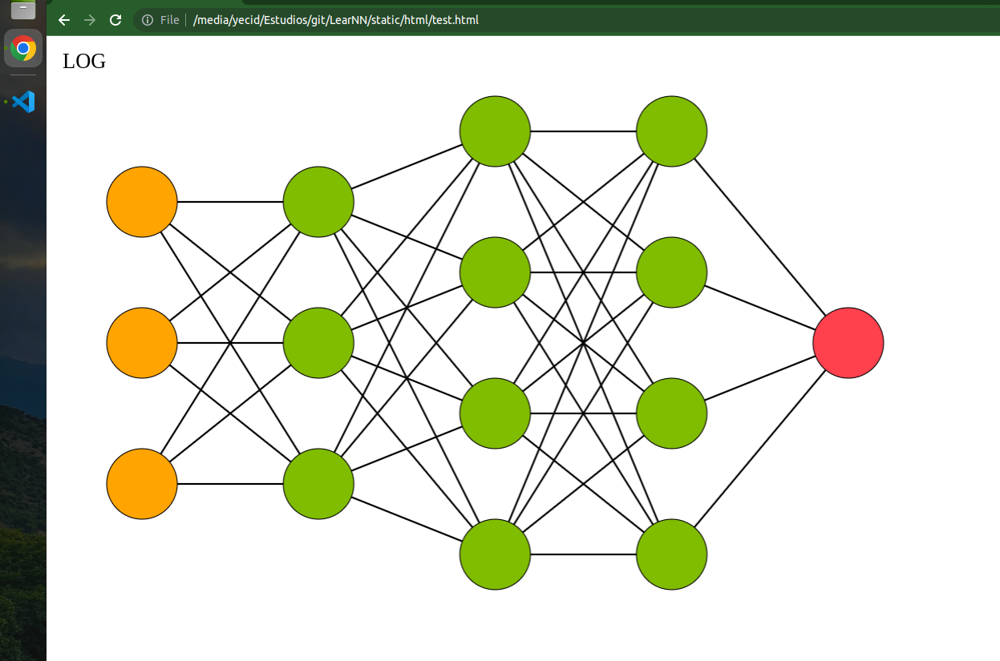
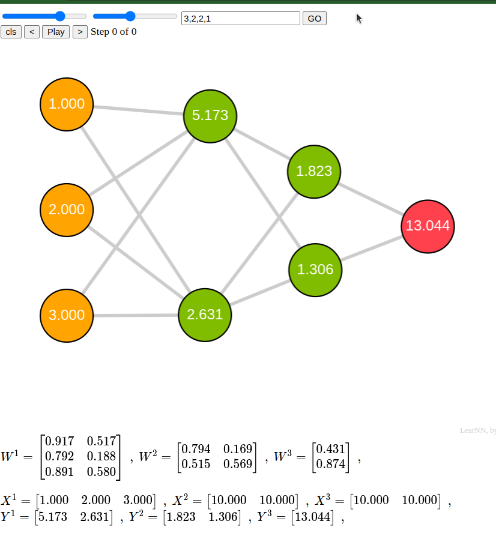

## LearNN
Software educativo para entendimendo de redes neurais.

# Cómo executar
1. Abrir o arquivo **(LearNN/static/html/test.html)** no browser
2. A brincar !!!

# Mudanças:
$\square$ Backpropagation
  
1. Implementouse uma interfaz que pega o arranjo com o numero de neuronios das camadas e apresenta na tela a representação gráfica da rede. Ex., Input = [3,3,4,4,1], cuja saida é mostrada ne seguinte imagem, as cores de entrada, aida e camdas ocultas são colocadas automaticas, de acordo à configuraçao do artigo.
   

2. Latex:
   - Matrizes de peso, entradas e saídas exibidas na tela
3. Animações:
   - Algoritmo backpropagation (primeira etapa, ff), com animações e atualizações de interface para cada paso realizada(matrizes,nós,linhas).
   - Evento Hover em cada linha
4. UI
   - Nós arrastáveis
   - $\pm$ Zoom na interface com a rodinha do mouse

<!-- https://hmkcode.com/ai/backpropagation-step-by-step/ -->